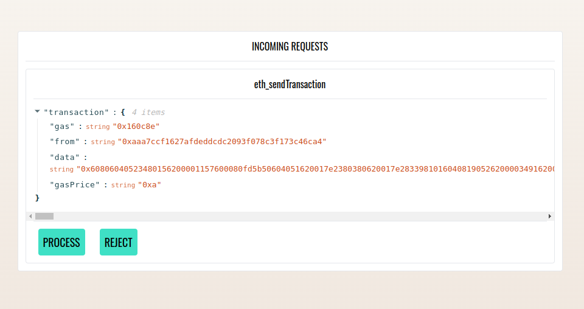

# <h1 align="center"> Template deploy DREX and WDREX public networks</h1>

**Template repository for getting started quickly with Hardhat and Truffle in one project - Deploy in network Bitfinity today**


### Getting Started

- Use Hardhat e Truffle dashboard

```bash
yarn install
```

```bash
yarn truffle dashboard
```

```bash
yarn deploy:DREX
```

- 

- Processe a transacao e seu contrato sera deployado na rede do Bitfinity

**Futuramente poderemos usar Bridge para a IC em https://docs.bitfinity.network/bridge/transfer-bitfinity-ic**


### Features

- Material do projeto Connexus que permite os usuarios terem seus cartoesTBA com os assets em DREX e RWAs.

### Notes

Fizemos um conjunto de implementações para ficar mais fácil o uso e deploy em diversas redes.
